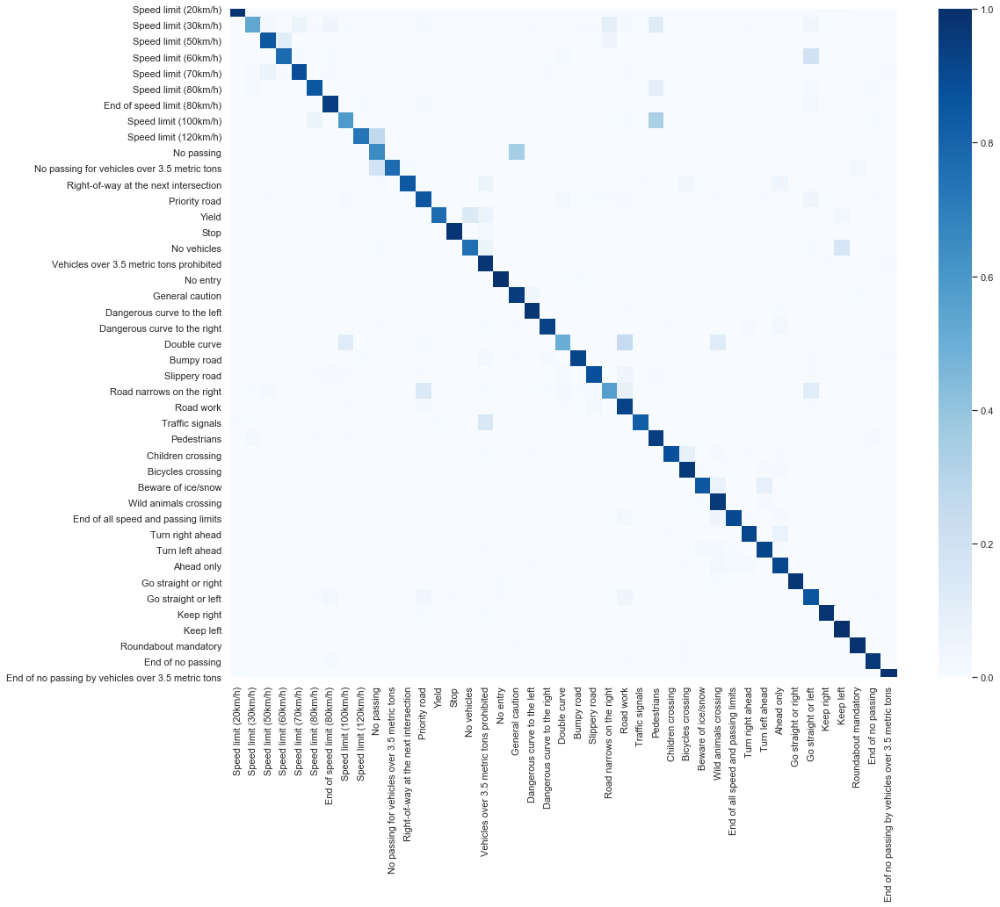
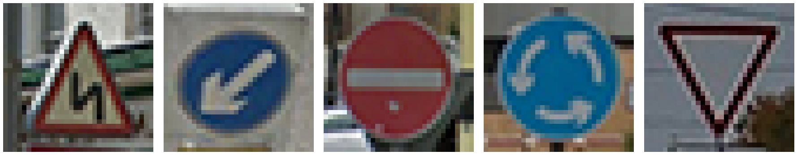
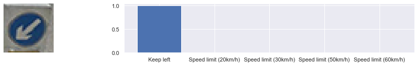
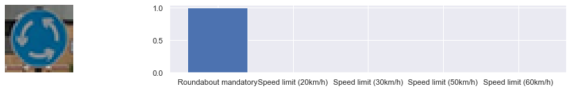
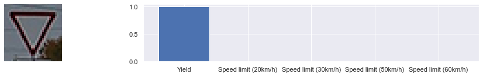

# **Traffic Sign Recognition** 

## Writeup

### You can use this file as a template for your writeup if you want to submit it as a markdown file, but feel free to use some other method and submit a pdf if you prefer.

---


**Build a Traffic Sign Recognition Project**

The goals / steps of this project are the following:
* Load the data set (see below for links to the project data set)
* Explore, summarize and visualize the data set
* Design, train and test a model architecture
* Use the model to make predictions on new images
* Analyze the softmax probabilities of the new images
* Summarize the results with a written report


[//]: # (Image References)

## Rubric Points
### Here I will consider the [rubric points](https://review.udacity.com/#!/rubrics/481/view) individually and describe how I addressed each point in my implementation.  

---

### Writeup / README


#### 1. Provide a Writeup / README that includes all the rubric points and how you addressed each one. You can submit your writeup as markdown or pdf. You can use this template as a guide for writing the report. The submission includes the project code.

You're reading it! and here is a link to my [project code](https://github.com/udacity/CarND-Traffic-Sign-Classifier-Project/blob/master/Traffic_Sign_Classifier.ipynb)


### Data Set Summary & Exploration


#### 1. Provide a basic summary of the data set. In the code, the analysis should be done using python, numpy and/or pandas methods rather than hardcoding results manually.

I used the numpy library to calculate summary statistics of the traffic
signs data set:

* The size of training set is 34799
* The size of the validation set is 4410
* The size of test set is 12630
* The shape of a traffic sign image is (32, 32, 3)
* The number of unique classes/labels in the data set is 43


#### 2. Include an exploratory visualization of the dataset.

Here is an exploratory visualization of the data set, I took a look at each sign class and visualized them:

[image1]: dataviz.png 
![alt text][image1]


Below It's a bar chart showing how the data is distributed among training and testing datasets. We can see that they each class is equally distributed :

[image2]: stats_summary.png
![alt text][image2]

### Design and Test a Model Architecture


#### Pre-process the Data Set (normalization, grayscale, etc.)

In order to feed correctly our dataset into the convolutional neural network and for the sake of resources, I used a normalization among each dataset and rescaled it from (0-255) to (0-1) using a MinMaxScaler.

#### Model Architecture

My final model was inspired from LeNet-5 architecture with few improvements (One added conv layer along with a tweak in the filter size, described in the following table:

My final model consisted of the following layers:

|Layer					|Description									|Activation										| Shape									| 
|:---------------------:|:---------------------------------------------:|:---------------------------------------------:| :------------------------------------:| 
| Input					| RGB image   									| -												| (32x32x3)								| 
| Convolution 5x5		| 1x1 stride, VALID padding						|ReLU											| (28x28x6)								| 
| Max pooling			| 2x2 stride,									|-												| (14x14x6)								| 
| Convolution 5x5		| 1x1 stride, VALID padding						|ReLU											| (10x10x12)							| 
| Convolution 3x3		| 1x1 stride, VALID padding						|ReLU											| (8x8x16)								| 
| Max pooling			| 2x2 stride,									|-												| (4x4x16)								| 
| Flatten				| Reshapes a single dimension array				|-												| (256)									| 
| Fully connected		| Hidden layer									|ReLU											| (120)									| 
| Fully connected		| Hidden layer									|ReLU											| (84)									| 
| Fully connected		| Output layer									|SoftMax										| (43)									| 

#### 3. Describe how you trained your model. The discussion can include the type of optimizer, the batch size, number of epochs and any hyperparameters such as learning rate.

To train the model, I used Adam optimimzer with the following hyper-parameters:

|Epochs					|Batch size									|Optimizer rate										| Learning rate									| 
|:---------------------:|:---------------------------------------------:|:---------------------------------------------:| :------------------------------------:| 
| 10					| 64   									| Adam												| 0.001								| 


#### 4. Describe the approach taken for finding a solution and getting the validation set accuracy to be at least 0.93.

My final model results were:
* training set accuracy of 0.992
* validation set accuracy of 0.945
* test set accuracy of 0.917

If an iterative approach was chosen:
* What was the first architecture that was tried and why was it chosen?

> I tried first LeNet-5 architecture provided in the lectures. I took it as first choice since it doesn't include too much complexity and hence it is training quickly.

* What were some problems with the initial architecture?

> I found a problem of the accuracy staying under 0.91 and just can't go further. I thought it might be some problem with the undedrfitting.

* How was the architecture adjusted and why was it adjusted? Typical adjustments could include choosing a different model architecture, adding or taking away layers (pooling, dropout, convolution, etc), using an activation function or changing the activation function. One common justification for adjusting an architecture would be due to overfitting or underfitting. A high accuracy on the training set but low accuracy on the validation set indicates over fitting; a low accuracy on both sets indicates under fitting.

> I added another convolutional layer between first and the second layer. This adds more complexity to our model so that it overcomes the problem of under-fitting

* Which parameters were tuned? How were they adjusted and why?

> I adjusted the learning rate to 0.001 in order to give the right step size to the optimizer either to learn quickly and not to miss the optimum

> I reduced also the batch size in order to give to the model a stochastic aspect and diversify its search regions

* What are some of the important design choices and why were they chosen? For example, why might a convolution layer work well with this problem? How might a dropout layer help with creating a successful model?
---
If a well known architecture was chosen:
* What architecture was chosen?
> Convolutional Neural Networks 
* Why did you believe it would be relevant to the traffic sign application?
> It's the most suitable architecture since our dataset contains images and they just can't be processed with a Fully Connected Layer (Extensive number of parameters)
* How does the final model's accuracy on the training, validation and test set provide evidence that the model is working well?
> Obviously the model has a 99% accuracy in training 94% in validation and 91% in test set. Performance is decreasing while we are digging into some unseen data but it's still a good score to keep the model able enough to generalize.


### Test a Model on New Images


#### 0. Confusion matrix on the test set

We can see that our model classifies correctly most of the sign except few errors.



#### 1. Choose five German traffic signs found on the web and provide them in the report. For each image, discuss what quality or qualities might be difficult to classify.

Here are five German traffic signs that I found on the web:



#### 2. Prediction results

Here are the results of top k probabilities of the prediction:








| Image							|     Prediction					| 
|:-----------------------------:|:---------------------------------:| 
| Slippery road   				| Slippery Road						| 
| Keep left     				| Keep left 						|
| No Entry						| No Entry							|
| Roundabout mandatory			| Roundabout mandatory				|
| Yield							| Yield								|


The model was able to correctly all the traffic signs, which gives an accuracy of 100%.


```python

```
